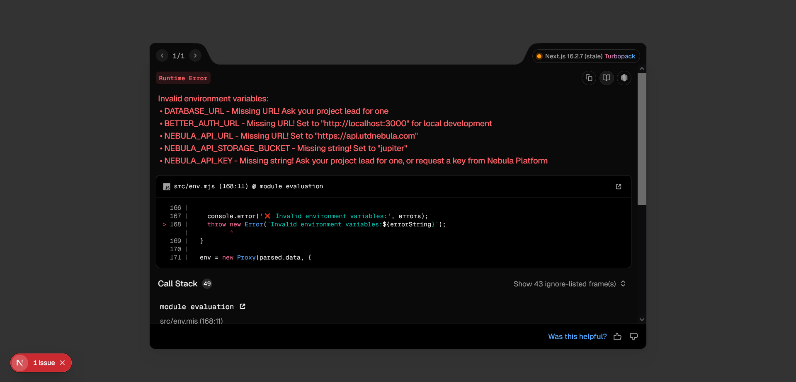

# Troubleshooting & FAQ

This guide provides fast, actionable solutions to common issues encountered when running or developing `utd-clubs`.

---

## Environment Variable Issues

### Error: `Invalid environment variables`



**Cause:** You are missing the listed environment variables in `.env`, or the variable is set to an invalid value.

**Solution:**

- Ensure you have copied `.env.example` to `.env`

  ```bash
  cp .env.example .env
  ```

  Then, fill in all the environment variables that are listed in the error message.

---

## Still Stuck?

Reach out to the team on [Discord](https://discord.utdnebula.com)!
